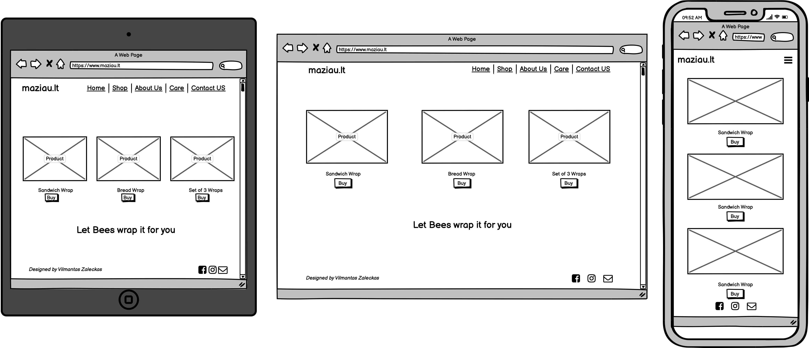
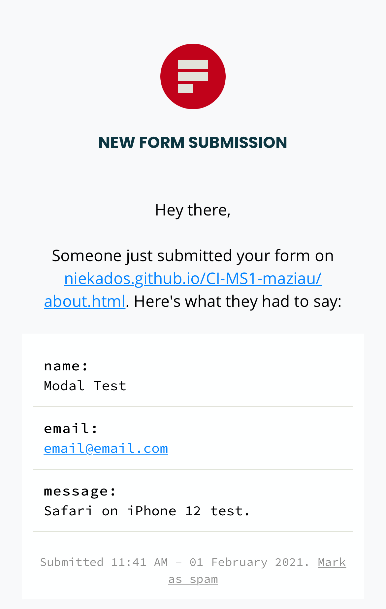
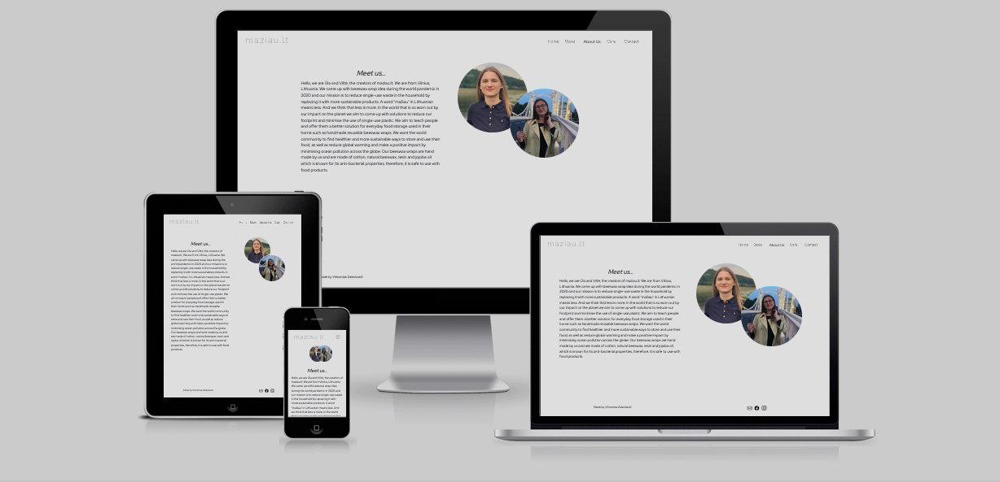

# Vilmantas Zaleckas
## Code Institute First Milestone Project 
## **maziau** 

Website project inspired by and made for two friends, my little sister and her friend, who are starting their handcraft business of beeswax wrappings. 
They have been making beeswax wraps for themselves, perfected the process and decided to take the next step and establish a micro-business 
to share the idea and their work with the community. They are starting with a very small budget of €200, so they will need all the help available! 
My role and the purpose of this project is to design and deploy the website and help them to reach a wider online audience. The website name comes from the idea of reducing 
the consumption of single-use plastic, which means less plastic will be thrown out. The word "less" translates to *"maziau"* in Lithuanian and this will be the name for their business. The idea and name dictate the design, 
which should be minimal and have less clutter for the user's eyes on the screen. Even the name starts with lowercase, to present that idea of minimalism, giving a simple, 
down to earth website name and authors approach to community and life.

## Index

- [Strategy](#strategy)
- [Scope](#scope)
- [User Stories](#user-stories)
- [Structure](#structure)
 - [Mobile](#mobile)
 - [Tablet](#tablet)
 - [Desktop](#desktop)
- [Features](#features)
- [Design](#design)
- [Wireframes](#wireframes)
- [Technologies Used](#technologies-used)
- [Deployment](#deployment)
- [Credits](#credits)
- [Testing](#testing)

## Strategy 
* Eliminate expenses of running the physical shop by setting up an online store.
* Increase sales by reaching a wider audience of customers 
* Be more accessible, easier to find (vs using only Facebook and Instagram) and have a professional presentation.
* Eliminate the impact of pandemic restrictions.
* Promote sustainable living.
* Introduce the product to new customers.
* Showcase the product to people who are aware of beeswax wraps and are looking to purchase it.
* Provide high quality and cheaper product compared to the mass-produced versions currently available on the market.
* Increase value and sustainability by handcraft production.
* Reduce carbon footprint by producing and shipping product in the local market. 
* Offer a selection of 3 items to reduce cognitive overload and be able to simplify manufacturing, which is limited to two employees at the moment. 
* Provide care instructions to increase the longevity and sustainability of a product.

## Scope

* Have minimalistic front store page to reflect name and idea of the brand with simple navigation, clear and bright images, catchy, short, playful and simple quotes to reflect store ethos.
* Present 3 sizes of beeswax wraps:
 1. Sandwich Wrap (Smallest one)
 2. Bread Wrap (Largest one)
 3. Multiset of 3 wraps (2 round-shaped wraps & 1 square-shaped wrap)
* Present website in two languages (English and Lithuanian) to target English and Lithuanian spoken customers.
* Have "About Us" page to introduce creators and establish more personal connection with the user, tell makers story and show genuine dedication to handcraft.
* Have "Contact Us" section for people and community to get in touch with product questions, postage inquiries, share experiences and feedback or ask for advice and support.
* Have section with care instructions for customers to improve the experience and prolong the life span of their wraps. Showing that *maziau* is oriented in the best quality and long use of their products. Present it in form of video tutorial and written step by step guidance.
* Have buy option linked to external and dedicated selling platform Shopify. This will reduce the cost and complexity of creating their online interface. Which in the future growth of 
the business can be changed to their online store without external selling platform.

## User Stories

* I am a sustainable person looking to reduce plastic usage in my day to day life. I am mindful of my daily plastic consumption and looking for an alternative to single-use plastic.
* I am a person concerned about aquatic animals and ocean pollution. I'm looking for a way to reduce plastic waste.
* I am a person who cares about my health and looking for ecological alternatives for plastic, as it harms my health.
* I am a crafty person and looking for handicrafts and supporting handcraft community.
* I am a person who likes to express myself in unusual and original ways and looking for different forms to express myself and highlight my personality.
* I am a person who enjoys beautiful things and loves to decorate my home and create cosiness.
* I am budget concerned person and looking for a solution to reduce my daily expenses.
* I am a person who is using beeswax wraps and looking to update my inventory with new products which would have the best price and quality balance.
* I am a person looking for an ergonomic solution, as my lunch box takes too much space in my bag.

### User Goals

##### First time visitor:

* I'd like to easily navigate the website, find and buy beeswax products.
* I'd like to see how the products look.
* I'd like to know how to care about my products.
* I'd like to know the background story of the store.
* I'd like to contact the business.

##### Returning visitor:
* I'd like to easily purchase the product again.
* I forgot how should I care for the product and like to see care instructions.
* I like the product and would like to follow the store on social media.

## Structure 

### Mobile 
* Minimalistic appearance.
* ***Navigation*** - located on the top of the browser window with logo on the right-hand side and hamburger menu with drop-down links for Home, Shop, About Us, Care, Contact and language selection.
* ***Footer*** - Email, Facebook, Instagram link icons centered.
* ***Shop*** - 3 images of different products, aligned vertically.
* ***About Us*** - a story of two friends and their idea of beeswax wraps with two creators pictures on the top (circle shape).
* ***Care*** - YouTube video tutorial with lists of caring steps listed below.
* ***Contact*** - pop up window available in any page with Name, Email, Message and Submit button. Close button on the top right corner. "Thank you" message on submit.

### Tablet
* Minimalistic appearance.
* ***Navigation*** Simple top navigation bar with logo on the left-hand side, navigation links centred on the screen, written from left to right: fixed to the top of the browser window. 
Language selection on the right-hand side of the navigation bar.
* ***Footer*** - on the right side: Email, Facebook, Instagram link icons and left side: copyright.
* Information presented with none or minimal scrolling.
* ***Index*** - page with a bright Hero image, quote under it and shop link.
* ***Shop*** - 3 images horizontally representing 3 different products. Short description and size bellow with a buy link.
* ***About Us*** - a story of two friends and their idea of beeswax wraps with two creators pictures on the right-hand side (circle shape). 
* ***Care*** - YouTube video tutorial with lists of caring steps listed below.
* ***Contact*** - pop up window available in any page with Name, Email, Message and Submit button. Close button on the top right corner. "Thank you" message on submit.

### Desktop
* Minimalistic appearance.
* ***Navigation*** Simple top navigation bar with logo on the left-hand side, navigation links from left to right: fixed to the top of the browser window. Language selection 
on the right-hand side of the navigation bar.
* ***Footer*** - on the right side: Email, Facebook, Instagram link icons and left side: copyright.
* Information presented with none or minimal scrolling.
* ***Index*** - page with a bright Hero image, quote under it and shop link.
* ***Shop*** - 3 images horizontally representing 3 different products. Short description and size bellow with a buy link.
* ***About Us*** - a story of two friends and their idea of beeswax wraps with two creators pictures on the right-hand side (circle shape). 
* ***Care*** - YouTube video tutorial with lists of caring steps listed below.
* ***Contact*** - pop up window available in any page with Name, Email, Message and Submit button. Close button on the top right corner. "Thank you" message on submit.

## Features

### Implemented

#### Shared elements between all pages
* Navigation Bar with 'maziau.lt' logo on the left-hand side and navigation links on the right-hand side, which will travel closer to the logo when the screen is scaled down. 
Navigation Bar will collapse on the Mobile view to 'burger drop-down menu', but still keeping logo on the left-hand side.
* Footer with website designers name on the left-hand side (a little bit away from the page edge, due to small text design which his made on purpose- not to distract the user from clean and minimalistic view, 
but at the same time is available if anyone is looking for an author. Social links and mail link on the right-hand side (a little bit away from the page edge, due to smaller icons, not to overwhelm minimal design, 
at the same time icons stand out as there is a lot of white, clean space. On a Mobile screen, both elements centre and social links displayed on top of the author's name.
* Contact Us - is in a form of the pop-up modal, which is available in every page, it will pop-up and close, without taking the user from the content they were viewing at that moment.
This feature is to create an impression, that we are always available to help if you have any questions. Modal has Name, Email and Message fields, together with Send and Close buttons, also an 'X' close button on the top right corner for users who are intuitively seeking 'X' to close. Modal is linked to [Formspree](https://formspree.io/) which on submit will open Thanks! message in a new window (limitation due to free version and removed if bought a premium version) 
and send all form details to the email address linked to it.

### Homepage

* Has large and bright image carousel, which is the main centrepiece for the visitor's attention, but at the same time due to minimal Black & White design leaves clear sight of Navigation Bar and Footer.
* Quote, located under the image carousel, not to give an impression of regular article design with Header followed by Content, it's more of a playful invitation to explore and at the same time, it's visible due to minimal design.
* Store button, to allow the user to discover beeswax products, without having to move their look and try to find it in Navigation Bar. It is an invitation!

### Store Page

* Playful quote placed at the top, due to delicate 'buy' buttons design, which conventionally is located under the product images. 
This way we are avoiding the overwhelming impression of too many things living in one part of the screen, balancing out the text on the screen, with images staying again in the centre.
* 3 images located at the centre, to keep users attention at the usual as Hompeage location on the screen. Images have short, and subtle descriptions, followed by 'buy' buttons bellow.
Desktop view is arranged horizontally, where mobile view changes to vertical positioning, to present larger pictures on a small screen.

### About Us page

This page has text on the left and girls pictures on the right in desktop mode, to show the user that the story and images are the same important and they share centre space and compliments each other.
On a mobile view due to small screen size, the pictures are shown at the top, followed by invitation to "Meet us..." and read our story below.
* Story is short and simple, attempting to make a connection with the user and have a brief introduction and explaining the idea behind.
* Pictures of two girls are represented in circle shapes, slightly overlapping each other and creating the impression of friends standing side by side. On Mobile, they are on the same level on X-axis, where on Desktop view it also has Y-axis level difference.

### Care Page

Very important to let the user know how to care about their product, letting them know that we also care that their product will last.
* Youtube video. What else would explain better how to care for your item, than a video tutorial, which again is a centre pice located at the centre of the screen and it maintains it's location on Desktop and Mobile views.
* Care instructions displayed as an ordered list, for a glance in case you don't want or not sure if you want to watch the video instructions. It will keep its location in the centre under the video on Desktop and Mobile views. 

### Enchansments For Future

'maziau.lt' creators will be looking to expand their product range, as 'maziau' - meaning 'less' in Lithuanian does not limit itself to only beeswax products.
They are thinking to add a small range of washable and reusable items like drinking straws, make-up pads and cotton produce bags.
The website will be able to have additional features:
* Additional range of products.
* Feature to switch languages between English and Lithuanian.
* Have a fully functional contact us pop-up, not relying on external services to process and store data.
* Have their e-commerce system, to break away from paid services used at the moment.
* Create additional section to educate the community and showcase their ideas of living with less single-use items. 

## Design

### Logo

A brand logo is a very important aspect of business representation, as a main experience of user has to be minimal and light for the mind and the eye, a decision was made 
not to use any graphical images to represent the business, instead just the short website name 'maziau.lt' is used as the brand.
The best choice was a very light, unusual, but easily readable font from 'google fonts'- Raleway Dots (Designed by Multiple Designers).

### Colours

To represent the minimal feel and screen cleanliness most basic colour pallet has been chosen, to the absolute core of colour palette- Black & White.
It is a very important feature, as the product will be used with customers food, it will be wrapped in it and has to leave an impression of cleanliness and sterility. 

### Images

Due to the colour choice, the only element which will stand out and play with users eyes is the image. It has to be colourful, but the same time not overwhelming with its contents.
To keep the connection with the idea of minimal website, simple and colourful images has been selected and has no other background, except colour, product or the touch of the hands interacting with it.

### Typography

It's not an easy task to choose one type of font to be used, but a couple of main criteria allowed to narrow down selection just to a couple of fonts out of all available with Google Fonts.
Font choice has to have these features:
* Comfortable to read.
* Be close to conventional fonts, but not very usual.
* Be playful in the most subtle way with slightly rounded corners, but not typical conventional.
* Not confuse the user with multiple different fonts.
* Have Lithuanian symbols available, to write Creators names: Ūla and Viltė without errors.
* Have Lithuanian symbols for adding language choice to the website, without having to change typography in the future.
Best font matching the criteria was 'Red Hat Display' Designed by MCKL and available on 'google fonts'.

## Wireframes

#### Homepage

#### Store

#### About us 

#### Care

#### Contact us 

*Full wireframes in .pdf format, please click [here](assets/wireframes/wireframes-maziau-all.pdf)* 

## Technologies Used

- [HTML5](https://en.wikipedia.org/wiki/HTML5)
- [CSS3](https://en.wikipedia.org/wiki/CSS) 
- [GitHub](https://github.com) 
- [GitPod](https://www.gitpod.io)
- [Bootstrap library](https://getbootstrap.com) 
- [Bootstrap icons](https://icons.getbootstrap.com)
- Balsamiq - for wireframes creation.
- [Google Fonts](https://fonts.google.com)
- Mac Os Preview - for scalling and edditing images.
- [Hover.css](https://ianlunn.github.io/Hover/) by Ian Lunn Design (used NavBar interactive animations)
- [Formspree](https://formspree.io/) - validating and receiving "Contact us" forms directly to email address.
- [favicon.io](https://favicon.io/) - Favicon generator to create favicon and make it compatible with different browsers.
- [Autoprefixer](https://autoprefixer.github.io/) - parses CSS and adds vendor prefixes to CSS rules.

## Deployment

This project has been developed using GitPod and pushed to GitHub Repository:

#### GitHub Pages

If you would like to deploy this page from GitHub, please follow these steps:

1. Go to [GitHub](https://github.com)
2. Log into the user account.
3. Click on 'CI-MS1-maziau' repository.
4. Click the 'Settings' tab.
5. Scroll down to 'GitHub Pages' section.
6. Select source from 'Branch' dropdown menu as 'master'
7. Click the 'Save' button located next to the 'Branch' dropdown menu.
8. After page automatically refreshes, scroll back to 'GitHub Pages' section.
9. Publishing link for the site will be available.

#### Locally

1. Log in to your GitHub account.
2. Find user 'niekados' and open 'CI-MS1-maziau' repository on the main page or just follow this link [maziau](https://github.com/niekados/CI-MS1-maziau).
3. Select 'Code' tab located on the top left-hand side of the screen, just under the repository name.
4. Bellow the 'Code' tab choose 'master' from the 'branch' drop-down menu.
5. Click green 'Code' dropdown menu located on the righthand side of the screen, on the same level as 'master' branch drop menu.
6. Choose clone options:
  - HTTPS link
  - Open with GitHub Desktop
  - Download ZIP file
  - Github CLI, copy command line to your terminal.  

## Credits

I would like to express a special thank you to:
- Code Institute for providing all learning material, creating the greatest community and opportunity for me to grow!
- [Iryna Inshyna](https://www.shutterstock.com/g/Iryna+Inshyna) for her most beautiful images for my index page and [shutterstock.com](https://www.shutterstock.com) for making them available to download:
  - [Hands Wrapping Avocado](https://www.shutterstock.com/image-photo/organic-fabric-covers-food-storage-unrecognizable-1871880022) 
 Royalty-free stock photo ID: 1871880022
  - [Wrapped Pear](https://www.shutterstock.com/image-photo/organic-fabric-covers-food-storage-reusable-1871880016) 
 Royalty-free stock photo ID: 1871880016
  - [Wrapped Celery](https://www.shutterstock.com/image-photo/organic-fabric-covers-food-storage-reusable-1871150038)
 Royalty-free stock photo ID: 1871150038
- [FrimuFilms](https://www.shutterstock.com/g/FrimuFilms) and [shutterstock.com](https://www.shutterstock.com) for very representative and beautiful sandwich wrapping picture.
   - [Woman hands wrapping a healthy sandwich in beeswax food wrap](https://www.shutterstock.com/image-photo/woman-hands-wrapping-healthy-sandwich-beeswax-1593962761)
 Royalty-free stock photo ID: 1593962761
- [Fevziie](https://www.shutterstock.com/g/Fevziie) and [shutterstock.com](https://www.shutterstock.com) for their fantastic bread wrap, perfect for our project!
  - [Reusable Beeswax Food Wraps](https://www.shutterstock.com/image-photo/reusable-beeswax-food-wraps-organic-fabric-1502197586)
 Royalty-free stock photo ID: 1502197586
- [Oksana Shufrych](https://www.shutterstock.com/g/oksix) and [shutterstock.com](https://www.shutterstock.com) for her war and high-quality image of stacked containers.
  - [Ecological type of packing food to keep it fresh](https://www.shutterstock.com/image-photo/ecological-type-packing-food-keep-fresh-1836258310)
 Royalty-free stock photo ID: 1836258310
- [Hover.css by Ian Lunn Design](https://ianlunn.github.io/Hover/) - for very useful NavBar interactive animations
- [Thierry Koblentz](https://alistapart.com/article/creating-intrinsic-ratios-for-video/) for helping me understand how to embed YouTube video and make it responsive!
- [Crafty Patti](https://www.youtube.com/channel/UCWThSqSZojlTjokx_M-nVPA) for her video of care instructions. Which embedded iframes I have used under YouTube Terms of Services Section 6, Subsection C, which grants each youtube user a non-exclusive license to access the public content on youtube and to use, reproduce, distribute, display and perform content as permitted through the functionality of youtube service. 
- Girl images for "About Us" page used from Vilte and Ula personal photo album with their permission.
- [Bootstrap library](https://getbootstrap.com)- for providing templates of [Navbar](https://getbootstrap.com/docs/4.6/components/navbar/), [Carousel](https://getbootstrap.com/docs/4.6/components/carousel/), [Modal](https://getbootstrap.com/docs/4.6/components/modal/), [Sticky footer](https://getbootstrap.com/docs/4.6/examples/sticky-footer/). 
 
## Testing

HTML Code has been tested for each individual page with [W3C Markup Validator](https://validator.w3.org/) and [W3C CSS Validator](https://jigsaw.w3.org/css-validator/):

### Homepage

### Store Page

### About Us Page

### Care Page

* care.html had an error. iframes embed from youtube had 'formborder' defined, which is obsolete in HTML5, this has been fixed by removing it and replacing with CSS code.

### style.css

## Modal Form Submission data

Tested by filling out Modal form and submitting it, this was delivered and confirmed to an email address with no errors.

### Lighthouse 

Tested with Chrome developer tool Lighthouse.

* Homepage had performance issue, but it is due to bootstrap library being large.
* Most performance issues on the remaining pages were linked to bootstarp library.
* All pages External Social Links and Store Page links to www.Shopify.com had a suggestion for ``rel="noreferrer"`` to be added to ``<a>`` link.
This has been addressed.

### Website Testing

Full website testing available in the excel sheet, which is best viewed with Microsoft Excel, it can be also viewed with google docs, Apple Numbers, Open Office or Libre Office.
The testing file can be downloaded and viewed [HERE](assets/testing/testing.xlsx).

### User Stories Testing

##### First time visitor:

* I'd like to easily navigate the website, find and buy beeswax products.
    * Website Structure is simply laid out in easy to understand form:
    * Homepage - Store - About Us - Care - Contact Us
    * Social links located at the bottom of the page.
    * Store button on Homepage to easily navigate to store page without any distractions.
    * Simple product description with images and Buy button bellow. 

* I'd like to see how the products look.
    * Large image Carousel visible on the homepage.
    * Each different item has images on Store Page. 

* I'd like to know how to care about my products.
    * Navigation bar has a link to Care Page.
    * Care instructions presented in Youtube video with easy steps to follow.
    * Ordered list clearly and simply presented on Care page. 

* I'd like to know the background story of the store.
    * About Us link available on Navigation Bar.
    * Creators story and pictures are on About Us page. 

* I'd like to contact the business.
    * Contact Us pop up Modal form is available on every page in Navigation Bar.
    * Email and Social Links are available on every page in the footer. 

##### Returning visitor:
* I'd like to easily purchase the product again.
    * Store Button is located in the middle of Homepage.
    * Store button located in Navigation Bar.
* I forgot how should I care for the product and like to see care instructions.
    * Care Instructions Located in Navigation Bar.
* I like the product and would like to follow the store on social media.
    * Social Links located in the footer.