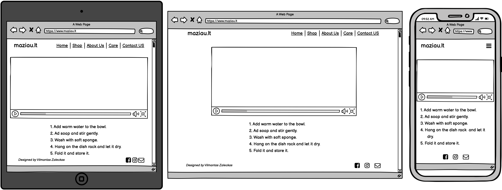

# Vilmantas Zaleckas
## Code Institute First Milestone Project 
## **maziau** 

Website project inspired by and made for two friends, my little sister and her friend, who are starting their handcraft business of beeswax wrappings. 
They have been making their own beeswax wraps for themselves, perfected the process and decided to take the next step and establish a micro-business 
to share the idea and their work with the community. They are starting with a very small budget of €200, so they will need all the help available! 
My role and the purpose of this project is to design and deploy the website and help them to reach a wider online audience. They live on opposite 
sides of Europe and the idea is to have a website for two regions: the United Kingdom and Lithuania, for this reason, they would like to have the website 
available in two languages: English and Lithuanian. The website name comes from the idea of reducing the consumption of single-use plastic, which means less 
plastic will be thrown out. The word less translates to *maziau* in Lithuanian and this will be the name for their business. The idea and name dictate the design, 
which should be minimal and have less clutter for the users eyes on screen. Even the name starts with lowercase, to present that idea of minimalism, giving a simple, 
down to earth website name.

## Strategy 
* Eliminate expenses of running the physical shop by setting up an online store.
* Increase sales by reaching a wider audience of customers 
* Be more accessible, easier to find (vs using only Facebook and Instagram) and have a professional presentation.
* Eliminate the impact of pandemic restrictions.
* Promote sustainable living.
* Introduce the product to new customers.
* Showcase the product to people who are aware of beeswax wrapps and are looking to purchase it.
* Provide high quality and cheaper product compared to the mass produced versions currently available on the market.
* Increase value and sustainability by handcraft production.
* Reduce carbon footprint by producing and shipping product in the local market. 
* Offer a selection of 3 items to reduce cognitive overload and be able to simplify manufacturing, which is limited to two employees at the moment. 
* Provide care instructions to increase longevity and sustainability of product.

## Scope

* Have minimalistic front store page to reflect name and idea of the brand with simple navigation, clear and bright images, catchy, short, playfull and simple quotes  to reflect store ethos.
* Present 3 sizes of beeswax wraps:
	1. Sandwich Wrap (Smallest one)
	2. Bread Wrap (Largest one)
	3. Multiset of 3 wraps (2 round-shaped wraps & 1 square-shaped wrap)
* Present website in two languages (English and Lithuanian) to target English and Lithuanian spoken customers.
* Have "About Us" page to introduce creators and establish more personal connection with the user, tell makers story and show genuine dedication to handcraft.
* Have contact us section for people and community to get in touch with product questions, postage inquiries, share experiences and feedback or ask for advice and support.
* Have section with care instructions for customers to improve the experience and prolong the life span of their wraps. Showing that *maziau* is oriented in the best quality and long use of 
their products. Present it in form of video tutorial and written step by step guidance.
* Have buy option linked to external and dedicated selling platform Shopify. This will reduce the cost and complexity of creating their own online interface. Which in the future growth of 
the business can be changed to their online store without external selling platform.

## Structure 

### Mobile 
* Minimalistic appearance.
* ***Navigation*** - located on the top of the browser window with logo on the right-hand side and hamburger menu with drop-down links for Home, Shop, About Us, Care, Contact and language selection.
* ***Footer*** - Email, Facebook, Instagram link icons centered.
* ***Shop*** - 3 images of different products, aligned vertically.
* ***About Us*** - a story of two friends and their idea of beeswax wraps with two creators pictures on the top (circle shape).
* ***Care*** - YouTube video tutorial with lists of caring steps listed below.
* ***Contact*** - pop up window available in any page with Name, Email, Message and Submit button. Close button on the top right corner. "Thank you" message on submit.

### Tablet
* Minimalistic appearance.
* ***Navigation*** Simple top navigation bar with logo on the left-hand side, navigation links centered on the screen, written from left to right: fixed to the top of the browser window. 
Language selection on the right-hand side of the navigation bar.
* ***Footer*** - on the right side: Email, Facebook, Instagram link icons and left side: copyright.
* Information presented with none or minimal scrolling.
* ***Index*** - page with a bright Hero image, quote under it and shop link.
* ***Shop*** - 3 images representing 3 different products in a horizontal manner. Short description and size bellow with a buy link.
* ***About Us*** - a story of two friends and their idea of beeswax wraps with two creators pictures on the right-hand side (circle shape). 
* ***Care*** - YouTube video tutorial with lists of caring steps listed below.
* ***Contact*** - pop up window available in any page with Name, Email, Message and Submit button. Close button on the top right corner. "Thank you" message on submit.

### Desktop
* Minimalistic appearance.
* ***Navigation*** Simple top navigation bar with logo on the left-hand side, navigation links from left to right: fixed to the top of the browser window. Language selection 
on the right-hand side of the navigation bar.
* ***Footer*** - on the right side: Email, Facebook, Instagram link icons and left side: copyright.
* Information presented with none or minimal scrolling.
* ***Index*** - page with a bright Hero image, quote under it and shop link.
* ***Shop*** - 3 images representing 3 different products in a horizontal manner. Short description and size bellow with a buy link.
* ***About Us*** - a story of two friends and their idea of beeswax wraps with two creators pictures on the right-hand side (circle shape). 
* ***Care*** - YouTube video tutorial with lists of caring steps listed below.
* ***Contact*** - pop up window available in any page with Name, Email, Message and Submit button. Close button on the top right corner. "Thank you" message on submit.

## Wireframes

#### Homepage

#### Store

#### About us 

#### Care

#### Contact us 

*Full wireframes in .pdf format, please click [here](assets/wireframes/wireframes-maziau-all.pdf)* 

## User Stories

* I am a sustainable person looking to reduce plastic usage in my day to day life. I am mindful of my daily plastic consumption and looking for an alternative to single-use plastic.
* I am a person concerned about aquatic animals and ocean pollution. I'm looking for a way to reduce plastic waste.
* I am a person who cares about my health and looking for ecological alternatives for plastic, as it has a harmful impact on my health.
* I am a crafty person and looking for handicrafts and supporting handcraft community.
* I am a person who likes to express myself in unusual and original ways and looking for different forms to express myself and highlight my personality.
* I am a person who enjoys beautiful things and loves to decorate my home and create cosiness.
* I am budget concerned person and looking for a solution to reduce my daily expenses.
* I am a person who is using beeswax wraps and looking to update my inventory with new products which would have the best price and quality balance.
* I am a person looking for an ergonomic solution, as my lunch box takes too much space in my bag.

### Credits

I would like to express special thank you to:
- Code Institute for providing all learning material, creating greatest communtiy and oportunity for me to grow!
- [Iryna Inshyna](https://www.shutterstock.com/g/Iryna+Inshyna) for her most beautiful images for my index page and [shutterstock.com](https://www.shutterstock.com) for making them available to download:
    - [Hands Wrapping Avocado](https://www.shutterstock.com/image-photo/organic-fabric-covers-food-storage-unrecognizable-1871880022) 
    Royalty-free stock photo ID: 1871880022
    - [Wrapped Pear](https://www.shutterstock.com/image-photo/organic-fabric-covers-food-storage-reusable-1871880016) 
    Royalty-free stock photo ID: 1871880016
    - [Wrapped Celery](https://www.shutterstock.com/image-photo/organic-fabric-covers-food-storage-reusable-1871150038)
    Royalty-free stock photo ID: 1871150038